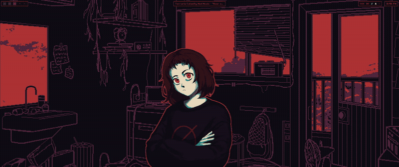

hyprmilk



A Milk Outside A Bag Of Milk themed desktop shell for Hyprland, written in QML
on Quickshell. Everything you see comes out of the actual game: the bedroom,
the girl, her dialogue, the sounds she mutters while text scrolls by.

The idea is simple. The game is a red-on-black visual novel about a girl who
can't sleep, and your desktop should feel like one more room in it. The
wallpaper is layered the same way the game layers its scenes. Behind everything
sits a red-dominant image, a CG or one of the painted sky frames. In front of
it is the room plate, drawn mostly in grey and black, with its window cutouts
punched out as transparent areas. So the red stuff only peeks through the
windows, which is exactly how the original scenes were composited.

Milk-Chan herself stands in the corner. She blinks on her own, breathes a
little, and her mouth moves while dialogue text is on screen. Click her (or
anywhere on the wallpaper) and she cycles through poses and emotions. Left
alone she drifts into new moods every minute or two. She also leans and
squashes very slightly with your cursor, which is the parallax bit.

The parallax is layered by depth. The wall behind her tracks the cursor at one
rate, the room plate at another, and she moves the most since she's the
closest thing to you. Everything eases with a slightly underdamped spring, so
quick cursor sweeps leave a bit of overshoot and settle. When you focus a
window the whole thing freezes in place, breathing included, and picks back up
when you return to the desktop.

Dialogue is the real treat. Lines come from the game's English translation,
typed out in the game's own font in milk red, with the game's talking loop
playing while the text reveals. The loop starts when a line appears and fades
when the typing finishes, at the game's own 20 characters per second. Lines
show up on demand, on a timer every few minutes, and the first time you enter
each room. Pressing SUPER+X forces one. Clicking the textbox skips the
typewriter, and clicking again dismisses it.

The bar up top is drawn from the game's UI kit, dark segments with wobbly
hand-drawn red frames. Workspace chips are per monitor and come straight from
the workspace rules in your hyprland config, so DP-3 shows 1 through 5 and
DP-2 shows 6 through 10 on this setup. Chips with windows render solid, empty
ones render hollow, and the active one lights up. There's a clock, volume,
Milk-Chan's voice toggle and a button for the control center. A music segment
appears when something is playing, fed by MPRIS, and the game radio is in
there too.

SUPER+SPACE opens the app launcher, which also carries the shell actions like
switching the wallpaper, toggling Milk-Chan, or starting the in-game radio.
SUPER+X shows a dialogue line. SUPER+W cycles the background layer, SUPER+G
toggles the girl, SUPER+Q opens the control center and SUPER+N the
notification center. The control center has volume and brightness sliders,
power actions, a calendar and a small CPU and RAM readout, all in the same red
frame style. Volume and brightness OSDs pop up when you change them.

The shell also knows about focus. Point a window at the screen and the
background holds still, sound and all. Point back at the desktop and it eases
back to life. The room ambience was dropped on purpose, it just got in the
way, but the talking loop, click sounds and the radio are all there when you
want them.

You need Hyprland, Quickshell 0.3.x, mpv, ffmpeg for the asset pipeline, and a
copy of Milk Outside A Bag Of Milk. The shell reads only rips, never the game
install itself.

The pipeline lives in tools. extract.sh pulls the Ren'Py archive apart with
unrpa, keeps the sprites, walls, radio, fonts and the GUI kit, and leaves the
rest. dialogue.py walks the scripts and translations and compiles them into
data modules the shell can read without touching disk at runtime.
gen_bindings.py reads your workspace rules out of hyprland.lua so the chips
match your monitors. gen_manifests.py inventories the sprites, the radio and
the wallpaper pool, and slices the hand-drawn frame used for every outline in
the UI. install.sh symlinks the shell into your Quickshell config directory,
installs the Retro Gaming font, and wires the autostart line plus a few
keybinds into hyprland.lua.

In short, from a fresh checkout:

```
./tools/extract.sh /path/to/steamapps/common/Milk\ outside\ a\ bag\ of\ milk\ outside\ a\ bag\ of\ milk
python3 tools/dialogue.py
python3 tools/gen_bindings.py
python3 tools/gen_manifests.py
./tools/install.sh
```

Then relog, or start `qs -c hyprmilk -n` by hand. The lock
screen theme for hyprlock gets applied too, same font, same red.

The root of the repo is the shell. shell.qml wires it together, and the
singletons live next to it: Theme for the palette, RoomState for everything
the wallpaper knows, Ui for visibility toggles and IPC, Music for MPRIS and
the radio, Sfx for sound, Cursor for pointer tracking. Feature folders hold
the panels: bar, bg, dialogue, launcher, music, notifs, osd, widgets, and a
controlcenter. data holds compiled JS modules, tools holds the pipeline
scripts, docs holds the older design notes.

Game audio routes through mpv. The talking loop and click sounds are on by
default, and room ambience is wired but switched off at the master switch in
Sfx.qml, since it wore out its welcome fast. Flip `ambientEnabled` if you
miss it.

A design note from earlier iterations lives in docs/PLAN.md, including the
sprite rig timings and the reasoning behind the layered wallpaper. The window
frame experiment that used to draw PNG borders around every window was pulled,
Hyprland's own red borders do that job without fighting the compositor.

Everything here is Arch tested at Quickshell 0.3.1 and Hyprland with the
hyprlua shim in place. The shim mangles bare dispatch strings, so the shell
talks to the Hyprland socket directly for workspace jumps.
